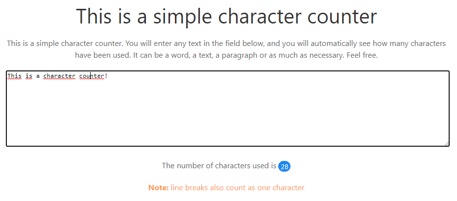

# Character Counter

This is a simple character counter made just for stud with HTML5, CSS3, JavaScript and Ulkit.

## Description

This project consists of a text box, where any text can be typed or pasted, and the counter will automatically count how many characters the text has.

## Visuals

Below, the image of the counter.

